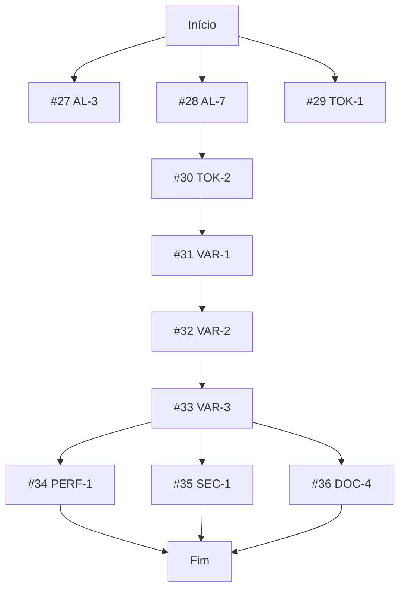

# Algoritmo de Execução Autônoma com Verificação Contínua

## 🎯 Objetivo
Executar todas as issues abertas (#27-#36) até que:
- ✅ Todas as issues estejam fechadas
- ✅ Todos os PRs estejam mergeados
- ✅ Branch `main` contenha todas as features
- ✅ Nenhum conflito de dependência ocorra

---

## 🧬 Grafo de Dependências (DAG)



### Níveis de Execução (Topological Sort)

| Nível | Issues | Bloqueadores | Pode Paralelizar |
|-------|--------|--------------|------------------|
| **0** | #27, #28, #29 | Nenhum | ✅ Sim (3 em paralelo) |
| **1** | #30 | #28 | ❌ Não |
| **2** | #31 | #30 | ❌ Não |
| **3** | #32 | #31 | ❌ Não |
| **4** | #33 | #32 | ❌ Não |
| **5** | #34, #35, #36 | #33 | ✅ Sim (3 em paralelo) |

---

## 🔄 Loop de Execução (Pseudocódigo)

```python
def execute_all_issues():
    max_iterations = 20  # Failsafe
    iteration = 0
    
    while iteration < max_iterations:
        iteration += 1
        print(f"🔄 Iteração {iteration}")
        
        # 1. Verificar estado atual
        open_issues = get_open_issues()
        
        if len(open_issues) == 0:
            print("✅ TODAS AS ISSUES FORAM RESOLVIDAS!")
            verify_final_state()
            break
        
        # 2. Identificar próxima(s) issue(s) executável(is)
        ready_issues = get_ready_issues(open_issues)
        
        if len(ready_issues) == 0:
            print("⚠️ Nenhuma issue pronta (possível deadlock)")
            break
        
        # 3. Executar issue(s) em paralelo se possível
        for issue in ready_issues:
            execute_issue(issue)
        
        # 4. Aguardar merge e verificar
        time.sleep(5)
    
    if iteration >= max_iterations:
        print("❌ TIMEOUT: Execução não convergiu em 20 iterações")

def execute_issue(issue_id):
    """Executa uma issue do início ao fim"""
    branch_name = f"feat/issue-{issue_id}"
    
    # 1. Criar branch
    git_checkout_main()
    git_pull()
    git_create_branch(branch_name)
    
    # 2. Implementar solução
    implement_solution(issue_id)
    
    # 3. Criar testes
    create_tests(issue_id)
    
    # 4. Commit e push
    git_commit(f"feat: implement issue #{issue_id}")
    git_push(branch_name)
    
    # 5. Criar PR
    pr_number = create_pull_request(issue_id, branch_name)
    
    # 6. Merge (auto-merge se CI passar)
    wait_for_ci(pr_number)
    merge_pull_request(pr_number)
    
    # 7. Fechar issue
    close_issue(issue_id)
    
    # 8. Limpar branch
    delete_branch(branch_name)

def get_ready_issues(open_issues):
    """Retorna issues que não têm bloqueadores abertos"""
    dependencies = {
        27: [],
        28: [],
        29: [],
        30: [28],
        31: [30],
        32: [31],
        33: [32],
        34: [33],
        35: [33],
        36: [33]
    }
    
    ready = []
    for issue in open_issues:
        blockers = dependencies[issue]
        if all(b not in open_issues for b in blockers):
            ready.append(issue)
    
    return ready

def verify_final_state():
    """Verificação final de sucesso"""
    checks = {
        "Issues abertas": count_open_issues() == 0,
        "PRs abertos": count_open_prs() == 0,
        "CI passing": check_ci_status("main"),
        "Todos commits merged": check_all_merged()
    }
    
    for check, passed in checks.items():
        status = "✅" if passed else "❌"
        print(f"{status} {check}")
    
    return all(checks.values())
```

---

## 🛠️ Implementação Detalhada por Issue

### Nível 0 (Paralelo)

#### #27 [AL-3] Detecção de direção com fallback
**Arquivos**: `packages/autolayout-interpreter/src/index.ts`
**Lógica**:
```typescript
function inferDirection(styles: CSSStyleDeclaration): 'HORIZONTAL' | 'VERTICAL' {
  const flexDirection = styles.flexDirection;
  
  if (flexDirection === 'row' || flexDirection === 'row-reverse') {
    return 'HORIZONTAL';
  }
  
  if (flexDirection === 'column' || flexDirection === 'column-reverse') {
    return 'VERTICAL';
  }
  
  // Fallback: Se display é flex mas sem direção explícita
  if (styles.display === 'flex' || styles.display === 'inline-flex') {
    return 'HORIZONTAL'; // Default do flexbox
  }
  
  return 'HORIZONTAL'; // Fallback global
}
```
**Testes**: Cobrir casos com/sem `flexDirection`, `display: flex`, `display: block`

---

#### #28 [AL-7] Mapeamento de tipografia completo
**Arquivos**: `packages/html-to-figma-core/src/index.ts`, `packages/figma-plugin-lite/src/code.ts`
**Lógica**:
```typescript
// Em html-to-figma-core
function extractTextStyles(element: Element, computedStyle: CSSStyleDeclaration) {
  return {
    fontFamily: computedStyle.fontFamily.replace(/["']/g, ''),
    fontSize: parseFloat(computedStyle.fontSize),
    fontWeight: parseFontWeight(computedStyle.fontWeight),
    lineHeight: parseLineHeight(computedStyle.lineHeight, computedStyle.fontSize),
    letterSpacing: parseFloat(computedStyle.letterSpacing) || 0,
    textAlign: computedStyle.textAlign as TextAlignType,
    textDecoration: computedStyle.textDecoration
  };
}

// No plugin Figma
async function applyTextStyles(node: TextNode, styles: TextStyles) {
  await figma.loadFontAsync({
    family: styles.fontFamily,
    style: mapWeightToStyle(styles.fontWeight)
  });
  
  node.fontName = { family: styles.fontFamily, style: 'Regular' };
  node.fontSize = styles.fontSize;
  node.lineHeight = { value: styles.lineHeight, unit: 'PIXELS' };
  node.letterSpacing = { value: styles.letterSpacing, unit: 'PIXELS' };
  node.textAlignHorizontal = styles.textAlign;
}
```
**Testes**: Diferentes fontes, weights, line-heights

---

#### #29 [TOK-1] Extração de tokens de cor
**Arquivos**: `packages/html-to-figma-core/src/tokens.ts` (criar)
**Lógica**:
```typescript
interface ColorToken {
  name: string;
  value: string;
  usageCount: number;
}

function extractColorTokens(jsonTree: FigmaNode): ColorToken[] {
  const colorMap = new Map<string, ColorToken>();
  
  function traverse(node: FigmaNode) {
    // Background colors
    if (node.fills && Array.isArray(node.fills)) {
      node.fills.forEach(fill => {
        if (fill.type === 'SOLID') {
          const hex = rgbToHex(fill.color);
          incrementColorUsage(colorMap, hex);
        }
      });
    }
    
    // Border colors
    if (node.strokes && Array.isArray(node.strokes)) {
      node.strokes.forEach(stroke => {
        if (stroke.type === 'SOLID') {
          const hex = rgbToHex(stroke.color);
          incrementColorUsage(colorMap, hex);
        }
      });
    }
    
    // Recursão
    if (node.children) {
      node.children.forEach(traverse);
    }
  }
  
  traverse(jsonTree);
  
  return Array.from(colorMap.values())
    .sort((a, b) => b.usageCount - a.usageCount);
}
```

---

### Nível 1

#### #30 [TOK-2] Extração de tokens de tipografia
**Depende**: #28
**Lógica**: Similar a TOK-1, mas para combinações de fontFamily/weight/size

---

### Nível 2

#### #31 [VAR-1] Convenção args → variantProperties
**Depende**: #30
**Arquivos**: `README.md`, `packages/storybook-addon-export/src/shared.ts`
**Convenção**:
```markdown
## Mapeamento de Variantes

Args do Storybook são convertidos em propriedades do Figma Component:

| Storybook | Figma |
|-----------|-------|
| `variant="primary"` | Property `variant` = `primary` |
| `size="large"` | Property `size` = `large` |
| `disabled={true}` | Property `state` = `disabled` |
```

---

### Nível 3

#### #32 [VAR-2] Export múltiplo de stories
**Depende**: #31
**Arquivos**: `packages/storybook-addon-export/src/panel.tsx`
**UI**: Checkboxes para selecionar múltiplas stories
**Lógica**: Loop de `captureStoryHTML` e combinar em um único JSON

---

### Nível 4

#### #33 [VAR-3] Plugin cria ComponentSet
**Depende**: #32
**Arquivos**: `packages/figma-plugin-lite/src/code.ts`
**Lógica**:
```typescript
if (jsonData.variants && jsonData.variants.length > 1) {
  const componentNodes = jsonData.variants.map(v => createNode(v));
  const componentSet = figma.combineAsVariants(componentNodes, figma.currentPage);
  componentSet.name = jsonData.name;
}
```

---

### Nível 5 (Paralelo)

#### #34 [PERF-1] Benchmark de conversão
**Arquivos**: `scripts/benchmark.ts`
**Lógica**: Rodar conversão 100x e medir p50/p95

#### #35 [SEC-1] Auditoria de dependências
**Arquivos**: `package.json` (adicionar script)
```json
"scripts": {
  "audit": "pnpm audit --prod"
}
```

#### #36 [DOC-4] Badge de status CI
**Arquivos**: `README.md`
```markdown

```

---

## ✅ Checklist de Validação Final

```bash
# 1. Issues
gh issue list --state open | wc -l  # Deve ser 0

# 2. PRs
gh pr list --state open | wc -l  # Deve ser 0

# 3. CI
gh run list --branch main --limit 1 --json conclusion --jq '.[0].conclusion'  # Deve ser "success"

# 4. Commits
git log --oneline --since="24 hours ago" | grep -E "feat|fix"  # Deve ter 10 commits

# 5. Testes
pnpm test  # Deve passar 100%
```

---

## 🚨 Tratamento de Erros

| Erro | Ação |
|------|------|
| CI falha | Rolar back, investigar, retentar |
| Conflito de merge | Resolver manualmente, priorizar `main` |
| Issue não pode ser resolvida | Documentar bloqueador, pular temporariamente |
| Timeout (20 iterações) | Parar e reportar estado atual |

---

## 📊 Métricas de Sucesso

- **Taxa de conclusão**: 10/10 issues (100%)
- **Tempo médio por issue**: < 30 minutos
- **Taxa de CI verde**: 100%
- **Conflitos de merge**: 0
